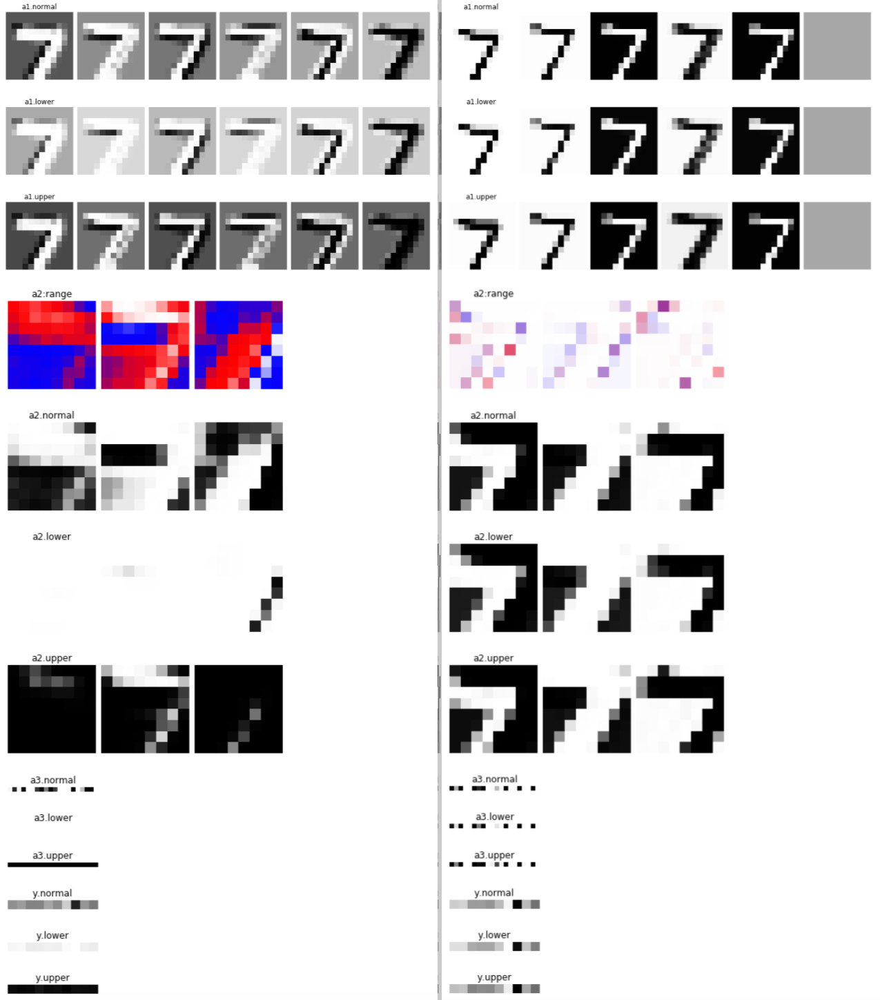

# Interval Bound Propagation

This is Chainer easy-to-follow implementation of Interval Bound Propagation. The MNIST experiment with small or medium models is implemented.

Paper: Sven Gowal, Krishnamurthy Dvijotham, Robert Stanforth, Rudy Bunel, Chongli Qin, Jonathan Uesato, Relja Arandjelovic, Timothy Mann, Pushmeet Kohli, [On the Effectiveness of Interval Bound Propagation for Training Verifiably Robust Models (Scalable Verified Training for Provably Robust Image Classification), ICCV 2019](https://arxiv.org/abs/1810.12715)

Authors' TensorFlow Code: [https://github.com/deepmind/interval-bound-propagation](https://github.com/deepmind/interval-bound-propagation)

```
python train_mnist.py -d 0 --model-class small
```

See `layers.py` or `models.py` for understanding the core of the algorithm.


## Visualize



The left is by a baseline model while the right is by a IBP-trained model.
Each shows the activation feature map of `normal`, `upper`- and `lower`-bounds at each layer.
The image of `range` shows the `upper - normal` and `normal - lower` diffs with red and blue respectively.
The more red, the more looser the upper bound is. The more blue, the more looser the lower bound is.

We can see the IBP-trained model produces noise-robust features.
And, its logit for classification (`y`), on the bottom, is also robust and consistently predicts 7 as the label while the baseline fails.

Visualization notebook is `visualize_interval_bound_propagation.ipynb`.

## TODO?

- [Achieving Verified Robustness to Symbol Substitutions via Interval Bound Propagation, EMNLP 2019](https://arxiv.org/abs/1909.01492)
